# VirtualFlowStudio v1.0 (Evaluation)

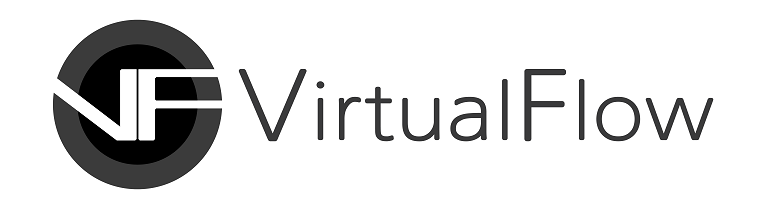

## A High-End 3D Tool for Content Creators

**VirtualFlow** provides you with a powerful toolset for creating Metaverse, with which anyone can create high-quality 3D contents fast and with ease, in Unreal Engine. Our goal is to demolish the technical barrier keeping you from developing various digital contents and thus bring about a future where you can become a digital creator who bestows upon his audience a splendid virtual reality.

## Provision of Brand-New Gameplay Framework and Powerful Toolset

**VirtualFlow Studio**—which was created with the help of the **T4Framework** plugin—is an Integrated Development Environment that enables you to utilize the powerful features of the Unreal Engine even without the technical knowledge on **Blueprint Visual Scripting** or **C++** programming language. **VirtualFlow Studio** provides you with a brand-new gameplay framework and a professional-level toolset, with which anybody can create an open-world multiplayer content. 

# VirtualFlow Studio

 

  

Awarded "Epic MegaGrant" from Epic Games Inc
  

## Information
- **VirtualFlow Studio Version**
  - T4Framework v1.0
- **Unreal Engine Version**
  - UE 5.0.3
- **Supported Platform**
  - Windows 64bit
- **License**
  - Evaluation (7 days)
- **Download Binaries**
  - https://github.com/VirtualFlowInc/VirtualFlowStudio_Public/releases
- **Website**
  - <a href="https://t4framework.com" target="_blank">https://t4framework.com</a>

## Installation
- Installing Unreal Engine 5.0
  - https://docs.unrealengine.com/4.26/en-US/Basics/InstallingUnrealEngine/
- Use either of the two methods listed below to download a T4Framework Project
  - Use “Code → Copy” (click the green button) then clone the repository using Git (you can use Git Gui programs like Github Desktop, SourceTree, GitKraken, etc.) to your computer
    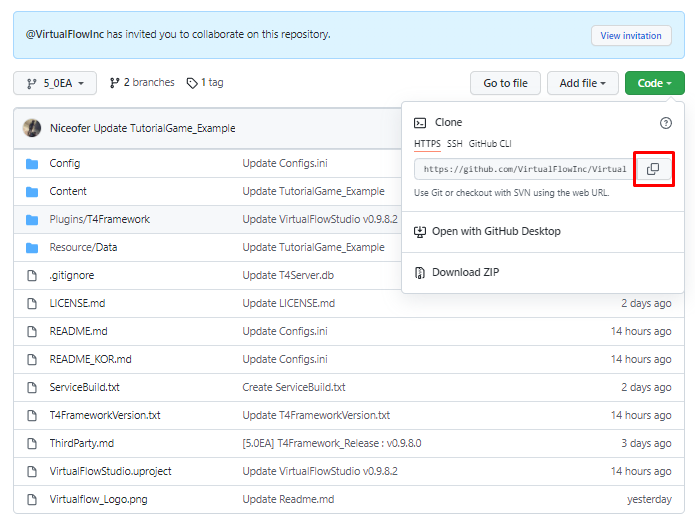
  - Click “Code → Download ZIP” to download the compressed T4Framework project then decompress it to open the project
    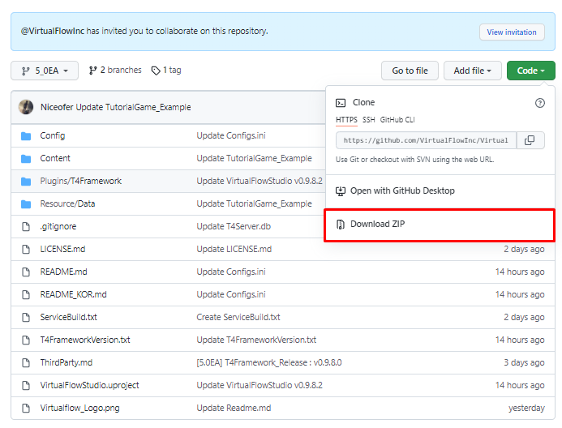
- If you’ve finished downloading the project, click the Releases version on the right
  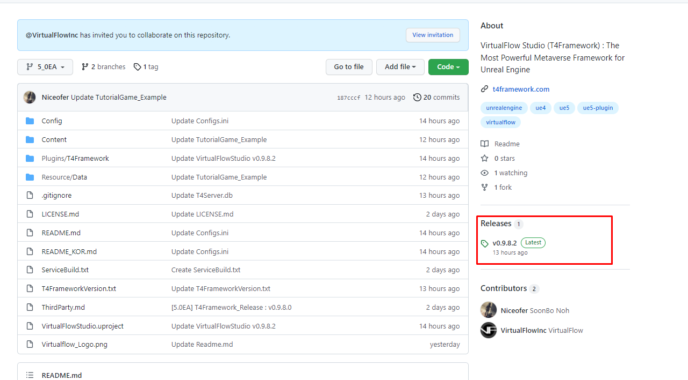
- In the Assets foldout menu, download the compressed “VirtualFlowStudio_Binary” file then decompress it
  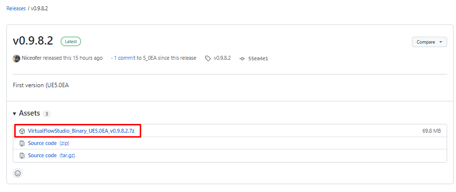
  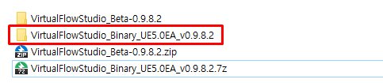
- Finish up the installation by moving the “Binaries” and “Plugins” folders in “VirtualFlowStudio_Binary” to the “VirtualFlowStudio(Beta)” project folder.
  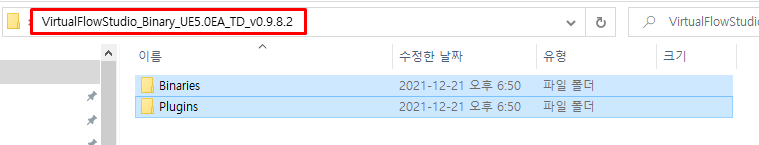
  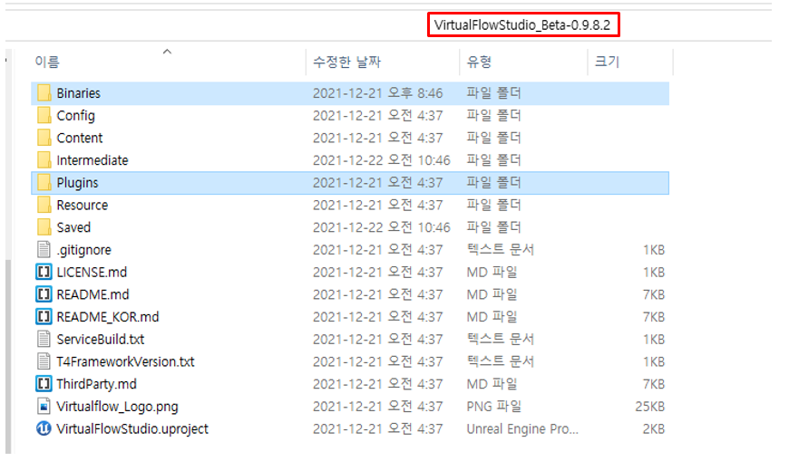
- Running a project that has T4Framework installed
  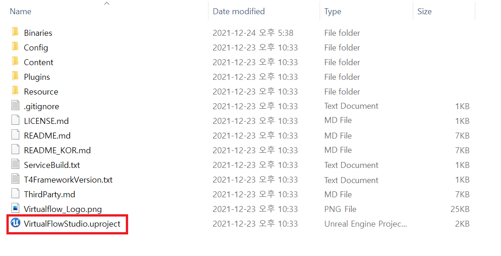
- Setting up DDC (Derived Data Cache) Folder
  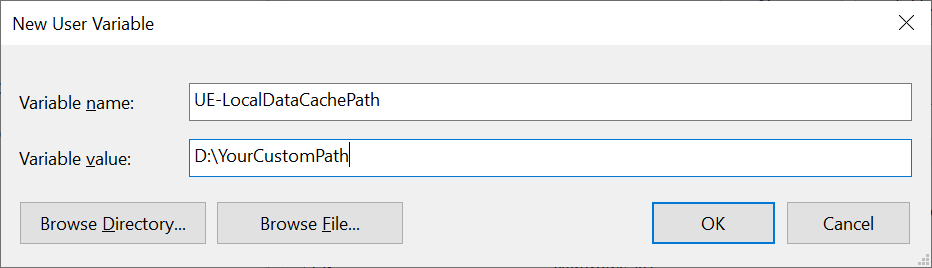

## Tutorials

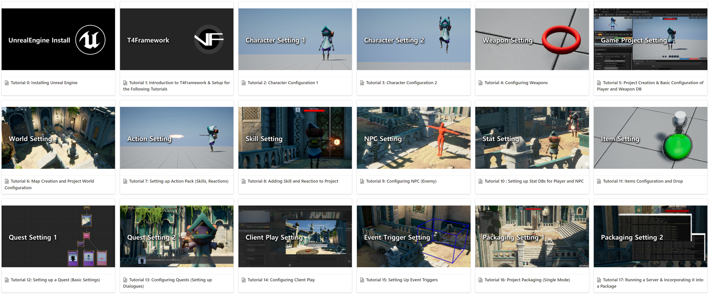
### Story Tutorial
- <a href="https://virtualflow.atlassian.net/wiki/spaces/T4FrameworkPublic/pages/64520193/Story+Tutorial" target="_blank">Story Tutorial 0 : Introduction to T4Framework & Setup for the Following Tutorials</a>
- <a href="https://virtualflow.atlassian.net/wiki/spaces/T4FrameworkPublic/pages/64520193/Story+Tutorial" target="_blank">Story Tutorial 1 : Character Settings 1</a>
- <a href="https://virtualflow.atlassian.net/wiki/spaces/T4FrameworkPublic/pages/64520193/Story+Tutorial" target="_blank">Story Tutorial 2 : Character Settings 2</a>
- <a href="https://virtualflow.atlassian.net/wiki/spaces/T4FrameworkPublic/pages/64520193/Story+Tutorial" target="_blank">Story Tutorial 3 : Project Creation & Basic Configuration of Player DB</a>
- <a href="https://virtualflow.atlassian.net/wiki/spaces/T4FrameworkPublic/pages/64520193/Story+Tutorial" target="_blank">Story Tutorial 4 : Map Creation and Project World Configuration</a>
- <a href="https://virtualflow.atlassian.net/wiki/spaces/T4FrameworkPublic/pages/64520193/Story+Tutorial" target="_blank">Story Tutorial 5 : Setting Up Event Triggers</a>
- <a href="https://virtualflow.atlassian.net/wiki/spaces/T4FrameworkPublic/pages/64520193/Story+Tutorial" target="_blank">Story Tutorial 6 : NPC</a>
- <a href="https://virtualflow.atlassian.net/wiki/spaces/T4FrameworkPublic/pages/64520193/Story+Tutorial" target="_blank">Story Tutorial 7 : Item Configuration</a>
- <a href="https://virtualflow.atlassian.net/wiki/spaces/T4FrameworkPublic/pages/64520193/Story+Tutorial" target="_blank">Story Tutorial 8 : Configuring Media</a>
- <a href="https://virtualflow.atlassian.net/wiki/spaces/T4FrameworkPublic/pages/64520193/Story+Tutorial" target="_blank">Story Tutorial 9 : Configuring Cinematics</a>
- <a href="https://virtualflow.atlassian.net/wiki/spaces/T4FrameworkPublic/pages/64520193/Story+Tutorial" target="_blank">Story Tutorial 10 : Configuring Client Play</a>
- <a href="https://virtualflow.atlassian.net/wiki/spaces/T4FrameworkPublic/pages/64520193/Story+Tutorial" target="_blank">Story Tutorial 11 : Setting up a Quest 1 (CaveEntrance Quest 1)</a>
- <a href="https://virtualflow.atlassian.net/wiki/spaces/T4FrameworkPublic/pages/64520193/Story+Tutorial" target="_blank">Story Tutorial 12 : Setting Up Quest (CaveEntrance Quest 2)</a>
- <a href="https://virtualflow.atlassian.net/wiki/spaces/T4FrameworkPublic/pages/64520193/Story+Tutorial" target="_blank">Story Tutorial 13 : Setting Up Quest 3 (Junkyard Quest 1)</a>
- <a href="https://virtualflow.atlassian.net/wiki/spaces/T4FrameworkPublic/pages/64520193/Story+Tutorial" target="_blank">Story Tutorial 14 : Setting Up Quest 4 (Junkyard Quest 2)</a>
- <a href="https://virtualflow.atlassian.net/wiki/spaces/T4FrameworkPublic/pages/64520193/Story+Tutorial" target="_blank">Story Tutorial 15 : Project Packaging</a>
- <a href="https://virtualflow.atlassian.net/wiki/spaces/T4FrameworkPublic/pages/64520193/Story+Tutorial" target="_blank">Project Narrative and Story Document (for Story Tutorial)</a>

### Game Tutorial
- <a href="https://virtualflow.atlassian.net/wiki/spaces/T4FrameworkPublic/pages/59408385/Game+Tutorial" target="_blank">Tutorial 0: Installing Unreal Engine</a>
- <a href="https://virtualflow.atlassian.net/wiki/spaces/T4FrameworkPublic/pages/59408385/Game+Tutorial" target="_blank">Tutorial 1: Introduction to T4Framework & Setup for the Following Tutorials</a>
- <a href="https://virtualflow.atlassian.net/wiki/spaces/T4FrameworkPublic/pages/59408385/Game+Tutorial" target="_blank">Tutorial 2: Character Settings 1</a>
- <a href="https://virtualflow.atlassian.net/wiki/spaces/T4FrameworkPublic/pages/59408385/Game+Tutorial" target="_blank">Tutorial 3: Character Settings 2</a>
- <a href="https://virtualflow.atlassian.net/wiki/spaces/T4FrameworkPublic/pages/59408385/Game+Tutorial" target="_blank">Tutorial 4: Configuring Weapons</a>
- <a href="https://virtualflow.atlassian.net/wiki/spaces/T4FrameworkPublic/pages/59408385/Game+Tutorial" target="_blank">Tutorial 5: Project Creation & Basic Configuration of Player and Weapon DB</a>
- <a href="https://virtualflow.atlassian.net/wiki/spaces/T4FrameworkPublic/pages/59408385/Game+Tutorial" target="_blank">Tutorial 6: Map Creation and Project World Configuration</a>
- <a href="https://virtualflow.atlassian.net/wiki/spaces/T4FrameworkPublic/pages/59408385/Game+Tutorial" target="_blank">Tutorial 7: Setting up Action Pack (Skills, Reactions)</a>
- <a href="https://virtualflow.atlassian.net/wiki/spaces/T4FrameworkPublic/pages/59408385/Game+Tutorial" target="_blank">Tutorial 8: Adding Skill and Reaction to Project</a>
- <a href="https://virtualflow.atlassian.net/wiki/spaces/T4FrameworkPublic/pages/59408385/Game+Tutorial" target="_blank">Tutorial 9: Configuring NPC (Enemy)</a>
- <a href="https://virtualflow.atlassian.net/wiki/spaces/T4FrameworkPublic/pages/59408385/Game+Tutorial" target="_blank">Tutorial 10 : Setting up Stat DBs for Player and NPC</a>
- <a href="https://virtualflow.atlassian.net/wiki/spaces/T4FrameworkPublic/pages/59408385/Game+Tutorial" target="_blank">Tutorial 11: Item Configuration and 'Drop' Settings</a>
- <a href="https://virtualflow.atlassian.net/wiki/spaces/T4FrameworkPublic/pages/59408385/Game+Tutorial" target="_blank">Tutorial 12: Setting up a Quest (Basic Settings)</a>
- <a href="https://virtualflow.atlassian.net/wiki/spaces/T4FrameworkPublic/pages/59408385/Game+Tutorial" target="_blank">Tutorial 13: Configuring Quests (Setting up Dialogues)</a>
- <a href="https://virtualflow.atlassian.net/wiki/spaces/T4FrameworkPublic/pages/59408385/Game+Tutorial" target="_blank">Tutorial 14: Configuring Client Play</a>
- <a href="https://virtualflow.atlassian.net/wiki/spaces/T4FrameworkPublic/pages/59408385/Game+Tutorial" target="_blank">Tutorial 15: Setting Up Event Triggers</a>
- <a href="https://virtualflow.atlassian.net/wiki/spaces/T4FrameworkPublic/pages/59408385/Game+Tutorial" target="_blank">Tutorial 16: Project Packaging (Single Mode)</a>
- <a href="https://virtualflow.atlassian.net/wiki/spaces/T4FrameworkPublic/pages/59408385/Game+Tutorial" target="_blank">Tutorial 17: Running a Server & Incorporating it into a Package</a>

# Community
- Discord 
  - https://discord.gg/7k238Cqh56
- Customer Service
  - t4framework@virtualflowinc.com
