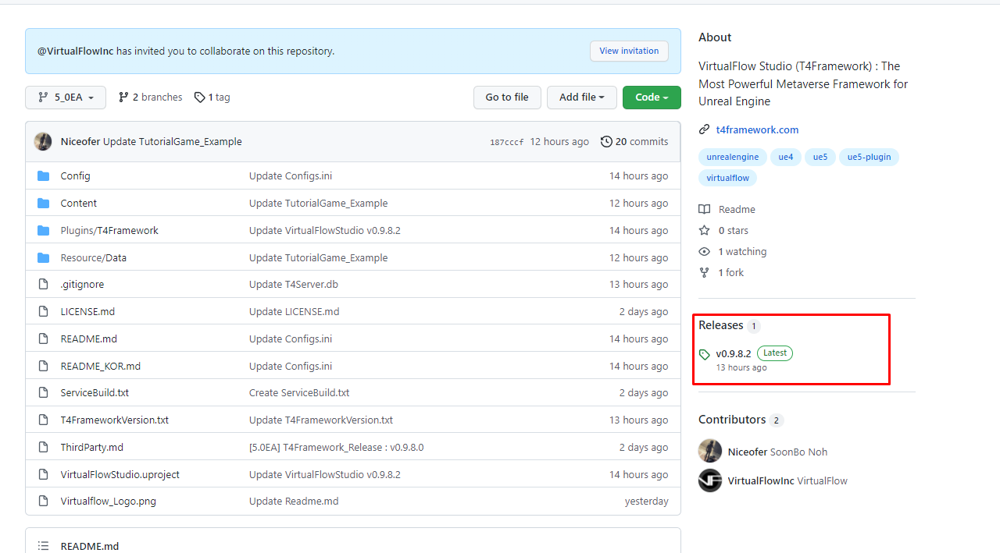
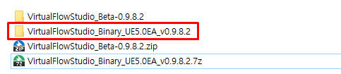
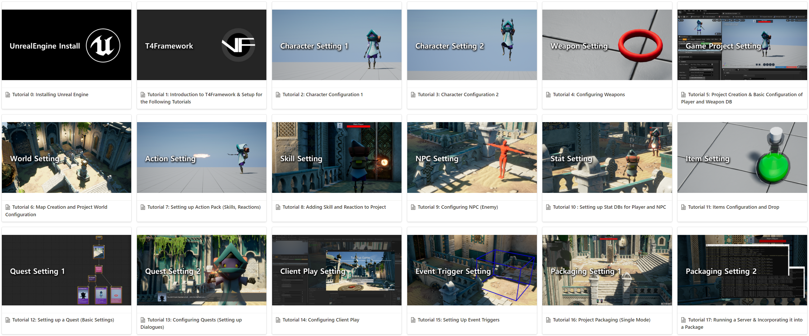

# VirtualFlowStudio v1.0 (Evaluation)

## 크리에이터를 위한 고품질 3D 콘텐츠 제작 지원

"VirtualFlow"는 언리얼 엔진을 활용해 누구나 쉽고 빠르게 고품질의 3D 콘텐츠를 개발할 수 있는 최적의 메타버스 개발 솔루션을 제공합니다. 
우리는 원하는 모두가 기술적 장벽 없이 다양한 콘텐츠의 개발에 자유롭게 참여하여 환상적인 가상 세계를 창조하는 디지털 크리에이터가 될 수 있는 미래를 만들고자 합니다.

## 새롭게 설계된 게임플레이 프레임워크와 툴셋 제공

"T4Framework" 플러그인으로 제작된 "VirtualFlow Studio"는 언리얼 엔진의 강력한 기능을 블루프린트 및 C++ 학습 없이도 콘텐츠를 제작할 수 있도록 다양한 통합 개발 환경으로
완전히 새롭게 설계된 게임플레이 프레임워크와 전문가 급의 개발 툴셋을 제공해 누구나 쉽게 오픈월드 멀티플레이어 콘텐츠를 구현할 수 있도록 지원합니다.

# VirtualFlow Studio

 

  

Awarded "Epic MegaGrant" from Epic Games Inc
  

## 정보
- **VirtualFlow Studio 버전**
  - T4Framework v1.0
- **언리얼 엔진 버전**
  - UE 5.0.3
- **지원 플랫폼**
  - Windows 64bit
- **라이선스**
  - Evaluation (7 days)
- **다운로드 (바이너리)**
  - https://github.com/VirtualFlowInc/VirtualFlowStudio_Public/releases
- **홈페이지**
  - <a href="https://t4framework.com" target="_blank">https://t4framework.com</a>
  
## 설치
- Unreal Enigne 5.0 설치
  - https://docs.unrealengine.com/4.26/en-US/Basics/InstallingUnrealEngine/
- 다음 2가지 방법 중 한 가지를 사용하여 프로젝트를 받아 줍니다.
  - Code - Download ZIP 버튼을 눌러 압축된 T4Framework 프로젝트를 받아주고, 다운로드가 끝나면 압축 해제해 줍니다.
    
  - Code - Clone 주소 복사 후 자신이 사용하는 Git GUI 프로그램(GitHub Desktop, Source Tree, GitKraken 등등..)을 이용하여 T4Framework 프로젝트를 복사합니다.
    
- 프로젝트를 다 받았다면, 우측 Releases에서 Latest 라벨이 붙은 버전을 클릭해줍니다.
  
- Asset 중 VirtualFlowStudio_Binary 압축 파일을 다운 받아주고, 다운로드가 끝나면 압축을 해제해 줍니다.
  
  
- VirtualFlowStudio_Binary 폴더 안에 있는 Binaries, Plugins 폴더를 T4Framework_UE5 폴더로 옮겨주면 모든 설치 과정은 마무리 됩니다.
  
  
- T4Framework가 설치된 프로젝트 실행
  
- DDC (Derived Data Cache) 폴더 설정
  

## 튜토리얼

### Story Tutorial
- <a href="https://virtualflow.atlassian.net/wiki/spaces/T4FrameworkPublic/pages/64520193/Story+Tutorial" target="_blank">Story Tutorial 0 : Introduction to T4Framework & Setup for the Following Tutorials</a>
- <a href="https://virtualflow.atlassian.net/wiki/spaces/T4FrameworkPublic/pages/64520193/Story+Tutorial" target="_blank">Story Tutorial 1 : Character Settings 1</a>
- <a href="https://virtualflow.atlassian.net/wiki/spaces/T4FrameworkPublic/pages/64520193/Story+Tutorial" target="_blank">Story Tutorial 2 : Character Settings 2</a>
- <a href="https://virtualflow.atlassian.net/wiki/spaces/T4FrameworkPublic/pages/64520193/Story+Tutorial" target="_blank">Story Tutorial 3 : Project Creation & Basic Configuration of Player DB</a>
- <a href="https://virtualflow.atlassian.net/wiki/spaces/T4FrameworkPublic/pages/64520193/Story+Tutorial" target="_blank">Story Tutorial 4 : Map Creation and Project World Configuration</a>
- <a href="https://virtualflow.atlassian.net/wiki/spaces/T4FrameworkPublic/pages/64520193/Story+Tutorial" target="_blank">Story Tutorial 5 : Setting Up Event Triggers</a>
- <a href="https://virtualflow.atlassian.net/wiki/spaces/T4FrameworkPublic/pages/64520193/Story+Tutorial" target="_blank">Story Tutorial 6 : NPC</a>
- <a href="https://virtualflow.atlassian.net/wiki/spaces/T4FrameworkPublic/pages/64520193/Story+Tutorial" target="_blank">Story Tutorial 7 : Item Configuration</a>
- <a href="https://virtualflow.atlassian.net/wiki/spaces/T4FrameworkPublic/pages/64520193/Story+Tutorial" target="_blank">Story Tutorial 8 : Configuring Media</a>
- <a href="https://virtualflow.atlassian.net/wiki/spaces/T4FrameworkPublic/pages/64520193/Story+Tutorial" target="_blank">Story Tutorial 9 : Configuring Cinematics</a>
- <a href="https://virtualflow.atlassian.net/wiki/spaces/T4FrameworkPublic/pages/64520193/Story+Tutorial" target="_blank">Story Tutorial 10 : Configuring Client Play</a>
- <a href="https://virtualflow.atlassian.net/wiki/spaces/T4FrameworkPublic/pages/64520193/Story+Tutorial" target="_blank">Story Tutorial 11 : Setting up a Quest 1 (CaveEntrance Quest 1)</a>
- <a href="https://virtualflow.atlassian.net/wiki/spaces/T4FrameworkPublic/pages/64520193/Story+Tutorial" target="_blank">Story Tutorial 12 : Setting Up Quest (CaveEntrance Quest 2)</a>
- <a href="https://virtualflow.atlassian.net/wiki/spaces/T4FrameworkPublic/pages/64520193/Story+Tutorial" target="_blank">Story Tutorial 13 : Setting Up Quest 3 (Junkyard Quest 1)</a>
- <a href="https://virtualflow.atlassian.net/wiki/spaces/T4FrameworkPublic/pages/64520193/Story+Tutorial" target="_blank">Story Tutorial 14 : Setting Up Quest 4 (Junkyard Quest 2)</a>
- <a href="https://virtualflow.atlassian.net/wiki/spaces/T4FrameworkPublic/pages/64520193/Story+Tutorial" target="_blank">Story Tutorial 15 : Project Packaging</a>
- <a href="https://virtualflow.atlassian.net/wiki/spaces/T4FrameworkPublic/pages/64520193/Story+Tutorial" target="_blank">Project Narrative and Story Document (for Story Tutorial)</a>

### Game Tutorial
- <a href="https://virtualflow.atlassian.net/wiki/spaces/T4FrameworkPublic/pages/59408385/Game+Tutorial" target="_blank">Tutorial 0: Installing Unreal Engine</a>
- <a href="https://virtualflow.atlassian.net/wiki/spaces/T4FrameworkPublic/pages/59408385/Game+Tutorial" target="_blank">Tutorial 1: Introduction to T4Framework & Setup for the Following Tutorials</a>
- <a href="https://virtualflow.atlassian.net/wiki/spaces/T4FrameworkPublic/pages/59408385/Game+Tutorial" target="_blank">Tutorial 2: Character Settings 1</a>
- <a href="https://virtualflow.atlassian.net/wiki/spaces/T4FrameworkPublic/pages/59408385/Game+Tutorial" target="_blank">Tutorial 3: Character Settings 2</a>
- <a href="https://virtualflow.atlassian.net/wiki/spaces/T4FrameworkPublic/pages/59408385/Game+Tutorial" target="_blank">Tutorial 4: Configuring Weapons</a>
- <a href="https://virtualflow.atlassian.net/wiki/spaces/T4FrameworkPublic/pages/59408385/Game+Tutorial" target="_blank">Tutorial 5: Project Creation & Basic Configuration of Player and Weapon DB</a>
- <a href="https://virtualflow.atlassian.net/wiki/spaces/T4FrameworkPublic/pages/59408385/Game+Tutorial" target="_blank">Tutorial 6: Map Creation and Project World Configuration</a>
- <a href="https://virtualflow.atlassian.net/wiki/spaces/T4FrameworkPublic/pages/59408385/Game+Tutorial" target="_blank">Tutorial 7: Setting up Action Pack (Skills, Reactions)</a>
- <a href="https://virtualflow.atlassian.net/wiki/spaces/T4FrameworkPublic/pages/59408385/Game+Tutorial" target="_blank">Tutorial 8: Adding Skill and Reaction to Project</a>
- <a href="https://virtualflow.atlassian.net/wiki/spaces/T4FrameworkPublic/pages/59408385/Game+Tutorial" target="_blank">Tutorial 9: Configuring NPC (Enemy)</a>
- <a href="https://virtualflow.atlassian.net/wiki/spaces/T4FrameworkPublic/pages/59408385/Game+Tutorial" target="_blank">Tutorial 10 : Setting up Stat DBs for Player and NPC</a>
- <a href="https://virtualflow.atlassian.net/wiki/spaces/T4FrameworkPublic/pages/59408385/Game+Tutorial" target="_blank">Tutorial 11: Item Configuration and 'Drop' Settings</a>
- <a href="https://virtualflow.atlassian.net/wiki/spaces/T4FrameworkPublic/pages/59408385/Game+Tutorial" target="_blank">Tutorial 12: Setting up a Quest (Basic Settings)</a>
- <a href="https://virtualflow.atlassian.net/wiki/spaces/T4FrameworkPublic/pages/59408385/Game+Tutorial" target="_blank">Tutorial 13: Configuring Quests (Setting up Dialogues)</a>
- <a href="https://virtualflow.atlassian.net/wiki/spaces/T4FrameworkPublic/pages/59408385/Game+Tutorial" target="_blank">Tutorial 14: Configuring Client Play</a>
- <a href="https://virtualflow.atlassian.net/wiki/spaces/T4FrameworkPublic/pages/59408385/Game+Tutorial" target="_blank">Tutorial 15: Setting Up Event Triggers</a>
- <a href="https://virtualflow.atlassian.net/wiki/spaces/T4FrameworkPublic/pages/59408385/Game+Tutorial" target="_blank">Tutorial 16: Project Packaging (Single Mode)</a>
- <a href="https://virtualflow.atlassian.net/wiki/spaces/T4FrameworkPublic/pages/59408385/Game+Tutorial" target="_blank">Tutorial 17: Running a Server & Incorporating it into a Package</a>

# 커뮤니티
- Discord
  - https://discord.gg/7k238Cqh56
- 문의
  - t4framework@virtualflowinc.com
